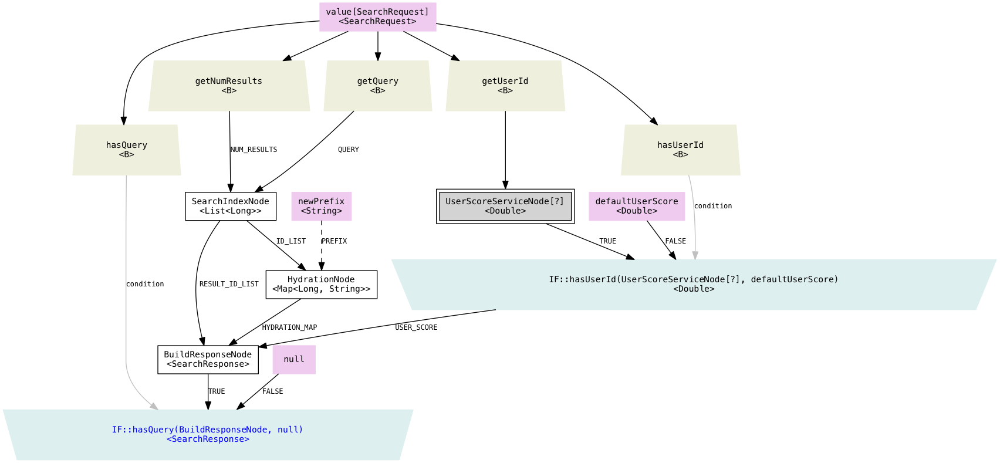

[](https://travis-ci.org/twitter/nodes) [](http://search.maven.org/#search%7Cgav%7C1%7Cg%3A%22com.twitter%22%20AND%20a%3A%22nodes%22)

Nodes
============================

Nodes is a library to implement asynchronous dependency graphs for services in Java.

## Background

When you write an asynchronous service, like an RPC server, or just a non-blocking library to do some work, you may need to implement an interface like this:

```java
Future<Response> processRequest(Request req)
```

Your logic goes inside `processRequest()`, you may do some local computation here, call some external services, or even run some code in another thread. The logic dependencies in these code could be complicated. [Finagle](https://twitter.github.io/finagle/) provides a good paradigm for [concurrent programming with Futures](http://twitter.github.io/finagle/guide/Futures.html). The `Future` class is a great building block, it decouples the execution logic and the thread scheduling, so the developer can focus on the logic dependencies rather than their actual execution. However, this library was written in Scala and isn't exactly Java friendly. It naturally involves a lot of callbacks and repeated function signatures. When it comes to waiting on multiple Futures, the code gets ugly very fast. Nodes is a Java library that aims to solve these problems, making the asynchronous code easier to read, to maintain and to test in Java.

## Basic Concepts
A node is an asynchronous processing unit. It takes multiple asynchronous input nodes (dependencies), and produces a single output. It will only start executing when all inputs are ready. A node object is also a handle to its output. Like `Future<A>` in Finagle, `Node<A>` represents an asynchronously computed data of type A. Actually `Node` and `Future` are mutually convertible. The tutorials below will show you how to create nodes and assemble them into a dependency graph.

Another way to understand nodes is to consider them asynchronous functions, every node with input of type A, B, C and return type of X can be thought as a function with signature:

```java
Future<X> process(Future<A> a, Future<B> b, Future<C> c)
```

## Tutorials

For quick examples, please see [src/main/java/com/twitter/nodes_examples](src/main/java/com/twitter/nodes_examples).

### Creating a Node

If your node has a fixed number (more than 1) of dependencies, the most common way to create a Node is as follows:

```java
// A node that produces an integer as output 
public class MyNode extends Node<Integer> {
  public enum D {  // "D" is a convention
    DEP1,
    DEP2,
    @OptionalDep DEP3  // this dependency is optional, may be omitted
  }

  @Override
  protected Future<Integer> evaluate() throws Exception { 
    // To get the value of a dependency nodes, use getDep(key)
    Type1 value1 = getDep(D.DEP1);
    Type2 value2 = getDep(D.DEP2);
    Type3 value3 = getDep(D.DEP3, someDefault);
    Integer result = compute(value1, value2, value3);
    return Future.value(result);
  }
}
```

You need write a `public` class extending `Node` (or `NullableNode`, more on this later) with a certain type, inside which you define enums for all your list of dependencies (the name convention is `D`). When you instantiate the node, you will use these enums to mark out your dependencies.

A dependency is by default *required* (without any marking), which means throwing an exception in it would fail the depending node directly and cause them not to get executed at all. Optional dependencies are marked as `@OptionalDep`, allowing them to be omitted or to fail.

> **Under the hood**: inside Node uses an `EnumMap` to store all dependency nodes. Even if you don't define your custom enum, there is a default one called `Node.DefaultDependencyEnum` that has 16 entries: `DEP0`, `DEP1` ... `DEP15`. If you directly use the constructor of the parent class to specify all your depdnencies, you will need to pass in a list of nodes, which will be mapped to these default enums in the order they appear.

You need to implement the `evaluate()` method, which will only be called when all dependencies are ready, and called only once. You can get values for each of the dependencies using `getDep()` and use them in your computation. At the end, you are supposed to return a `Future` object with desired return type. If you don't have any asynchronous processing inside, you can just wrap your output with `Future.value()`. However, you can also call other asynchronous services like a remote server, or submit tasks to another thread, and pass back the `Future` object you acquired from them directly.

There is always a simple way to create a multiple-dependency node inline with Java 8 lambda functions, with support for up to 4 inputs. See [Map with Multiple Inputs](#map-multiple) for more details.

#### Instantiating the Node

To instantiate your node with enum-based dependencies:

```java
Node<Integer> resultNode = Node.build(
    MyNode.class,
    MyNode.D.DEP1, node1,
    MyNode.D.DEP2, node2,
    MyNode.D.DEP3, node3);
```

You can omit the optional dependency without causing any runtime exception.

```java
Node<Integer> resultNode = Node.build(
    MyNode.class,
    MyNode.D.DEP1, node1,
    MyNode.D.DEP2, node2);
```

Or the input can even be a failure, for example:

```java
Node<Integer> resultNode = Node.build(
    MyNode.class,
    MyNode.D.DEP1, node1,
    MyNode.D.DEP2, node2,
    MyNode.D.DEP3, Node.fail(new Exception()));
```

#### NullableNode

Normally a node shouldn't return a `null` value, an exception would be thrown if it encounters a null output. You should try to use the control flow methods (see below) to manage the execution and make `null` value unnecessary, or utilize `Optional<A>` to represent return values that can be null. However, we also provide `NullableNode` which you can extend from, they can return `null` without causing any exception. The reason we make default `Node` class null-unfriendly is to make it easy to reason what went wrong during the execution, and not to confuse an error with a non-existent value, but overall this is a matter of style. The `NullableNode` is convenient but you should use it with care.

#### ServiceNode

Most of the nodes are just doing local computations. For nodes that calls any asynchronous service, be it an external Thrift RPC server, an HTTP server, or just a in-process scheduler that runs tasks in a thread pool, you can extend from `ServiceNode`, which provides some convenience for dealing with services. Rather than implementing `evaluate()`, you need to implement `buildRequest()` and `getService()`.

The method `buildRequst()` builds the request for current service call, in the parent class it's called in `evaluate()` so all dependencies should already be ready.

The method `getService()` gets a Finagle `Service` object, with has a method `Future<Response> apply(Request req)`. You can get this object from some factory, some registry, or simply from some static variables.

```java
public class NodeServiceNode extends ServiceNode<Response> {
  @Override
  public Service<Request, Response> getService() {
    ...
  }
  
  @Override
  public Request buildRequest() {
    // this is called inside evaluate(), you can get all your dependencies
    // the same way, or just get them from your own member variable.
  }
}
```

To specify the dependencies, you can either use the same enum-based solution described above, or directly use Node's own constructor (which takes a list of nodes). You can even implement your own constructor if it takes some special inputs more than dependending nodes.

### Executing a Dependency Graph

A node (which also denotes a dependency tree rooted at it) doesn't get executed automatically after they are constructed. The instantiation of the node only defines the logic dependency, but nothing has executed yet. To start running, you need to call `apply()`:

```java
Future<A> aFuture = aNode.apply();
```

This creates a `Future` of the node, which you can wait on. This will trigger the evaluation of all its dependencies and cause their `apply()` to get called, and in turn trigger the execution recursively. You start from the root of a tree and it eventually reaches all leaves, which are inputs. Only the nodes reachable by walking the dependency links will be executed.

You can just pass this `Future` object to anywhere it's needed, like inside the `processRequest()` method of your server implementation in the example at the beginning. If you want to block on it and get its value, you can call:

```java
A a = Await.result(aNode.apply(), Duration.ofSeconds(2));
```

### Sinks

As mentioned above, only the node reachable by the dependency link from an executing node will ever be executed. However, there are situations where we want a node to execute but no one is waiting for its result (like you want to start and forget a logging process after a request has been processed, but you can respond without waiting for that logging work to be done). You can implement this logic with Sinks, a set of nodes you attach to another node which gets executed *after* it has finished. It's like a reverse dependency.

```java 
Node<Integer> resultNode = Node.builder(MyNode.class)
  .withSinkNodes(s1, s2, ...)
  .withDependencies(
    MyNode.D.DEP1, node1,
    MyNode.D.DEP2, node2,
    MyNode.D.DEP3, node3);
    
// You can also set the sink after the node is created
resultNode.setSinkNodes(s1, s2, ...);
```

### Deciders

Nodes can be selectively turned on and off by "Deciders", which is just a simple `Supplier` object that produces a true/false value. You can use this to implement runtime control of your nodes. Having supplier return `false` would cause node not to execute and return failure.

```java 
// You can add deciders and sinks as well
Node<Integer> resultNode = Node.builder(MyNode.class)
  .withDeciderSupplier(someDeciderSupplier)
  .withDependencies(
    MyNode.D.DEP1, node1,
    MyNode.D.DEP2, node2,
    MyNode.D.DEP3, node3);
```

### Nodes without a Body

You node doesn't need to always have a computation class, it can directly wrap a value or a `Future` object.

```java
// To wrap node around an immediate value, without any computation process:
Node<A> nodeA = Node.value(somethingOfTypeA);

// To wrap node around a Finagle Future of type A
Future<A> futureA = ...;
Node<A> nodeA = Node.wrapFuture(futureA);
```

As we mentioned above, a `Node` can be converted to a `Future` by just calling `apply()`:

```java
Node<A> nodeA = ...;
Future<A> futureA = nodeA.apply();
```

A future may fail and return exception, if it's used as a required dependency of another node, it would fail that node. Of course you can make it an optional dependency, but it may not always be feasible when you are calling some existing node code. You can make create a "safe" node masking `Future`'s failure. All failures will simply become `null` result.

```java
Node<A> nodeA = ...;  // this may fail
Future<A> futureA = nodeA.toFutureSafe();
```

#### Node Literals

There are some node literals for your convenience.

```java
Node.TRUE           // Node<Boolean> with True value
Node.FALSE          // Node<Boolean> with False value
Node.NULL_NODE      // typeless Node with a null value
Node.<T>noValue()   // typed Node with a null value

// To create a literal failed node
Node.fail(Throwable t)
```

### Subgraph

Putting your whole graph in a single file is probably not convenient. Subgraph provides a way to organize your graph. Subgraph is a subset of the graph (duh), its inputs/outputs consist of the union of all inputs/outputs of the nodes at the boundary, so it can have more than 1 input and more than 1 output.

Subgraph doesn't have any effect on the execution of the nodes, it's just a way to organize nodes into a more reusable way. Below is a recommended style to implement Subgraphs.

```java
public class MySubgraph extends Subgraph {
  public final Node<Type1> exposedNode1; 
  public final Node<Type2> exposedNode2; 

  public MySubgraph(Node<A> inputNode1, 
                    Node<B> inputNode2,
                    Node<C> inputNode3) {
                    
    // ... all the wiring
    
    this.exposedNode1 = ... 
    this.exposedNode2 = ...
 
    // only needed if you need to generate DOT graph
    markExposedNodes();
  }
}
 
// Constructing two copies of the same subgraph, using different inputs:
MySubgraph s1 = new MySubgraph(node1, node2, node3);
MySubgraph s2 = new MySubgraph(node4, node5, node6);

// Access its produced outputs referencing the public members:
//   s1.exposedNode1
//   s2.exposedNode2
```

The suggested style is:

* Subclass from Subgraph
* All input nodes as constructor arguments
* All output nodes as public member variables
* You can also have other non-node input to configure the subgraph and provide other information.

The existence of subgraphs is transparent to the final dependency graph. You can always flatten a subgraph at its caller side, or split a subgraph into more smaller subgraphs if that helps with your modularity.

The call to the `markExposedNodes()` method at the end is purely for bookkeeping, this will help you generate better visualization/debug message, but it has no impact on the execution. Even if you forget to call it, it not a big deal.

### Node Transformations

For nodes with only a single input/dependency, it's cumbersome to create a whole new node class. We provide many syntactic sugar for you to do this kind of transformations easily.

#### map and flatMap

You can convert a node of type A to type B using a map. You only need to provide a function (in the form of a name string and a Java function, or a `NamedFunction` object). You can also do a `flatMap` where your function returns a `Future<B>` rather than straight type B, so you can call other asynchronous process inside.

```java
// To convert the node of one type to another, synchronously
Node<B> bNode = aNode.map(namedFunction);      // map with a NamedFunction<A,B>

Node<B> bNode = aNode.mapOnSuccess(func);   // only when aNode is successfully done, or emit null
Node<B> bNode = aNode.mapWithDeciderSupplier(ds, func);   // only when decider is on
 
// To convert the node of one type to another, asynchronously
Node<B> bNode = aNode.flatMap(func);   // where func is an instance of NamedFunction<A, Future<B>>
Node<B> bNode = aNode.flatMapOnSuccess(func);   // only when aNode is successfully done, or emit null
Node<B> bNode = aNode.flatMapWithDeciderSupplier(ds, func);   // only when aNode is successfully done, or emit null
 
// To get a boolean value out of node:
Node<Boolean> booleanNode = aNode.predicate(pred);  // where pred is a NamedPredicate<A>
 
// Java 8 support: you can also use Java 8 function in all above cases, except that you need to provide a name
// as the first argument. The name is only used for tracking and debugging, and ignored in production.
// For example:
Node<B> bNode = aNode.map("name", a -> doSomethingTo(a));
Node<B> bNode = aNode.map("name", a -> { ... });
Node<B> bNode = aNode.map("name", SomeClass::staticMethodOnA);
Node<B> bNode = aNode.map("name", someObject::instanceMethodOnA);
// same applies to .mapOnSuccess(), .flatMap(), etc
```

#### <a name="map-multiple"></a> Map with Multiple Inputs
Actually we also support map with multiple inputs, this can be used to implement simple multi-dependency node as well, rather than using enum-based dependency definitions:

```java
Node<X> nodeX = Node.map2(
    "map2", nodeA, nodeB, (a, b) -> {...})

Node<X> nodeX = Node.map3(
    "map3", nodeA, nodeB, nodeC, (a, b, c) -> {...})

Node<X> nodeX = Node.map4(
    "map4", nodeA, nodeB, nodeC, nodeD, (a, b, c, d) -> {...})
```

Also there are `flatMap` versions, the function passed in should return a `Future<X>` instead.

You can use these mappers/flatMappers to implement simple nodes with no optional dependencies. You can test them by just testing the normal function passed in.

#### Bolean operations

We provide some convenient methods for manipulating nodes wiht boolean values:

```java
// Boolean nodes
Node<Boolean> booleaNode = AndNode.create(b1Node, b2Node, b3Node, ...);
Node<Boolean> booleaNode = AndNode.createLazy(b1Node, b2Node, b3Node, ...);  // short-circuiting, will not evaluate later nodes
Node<Boolean> booleaNode = OrNode.create(b1Node, b2Node, b3Node, ...);
Node<Boolean> booleaNode = OrNode.createLazy(b1Node, b2Node, b3Node, ...);  // short-circuiting, ditto
Node<Boolean> booleaNode = NotNode.create(b1Node);
```

Note that the "lazy" version would short-circuit the execution, not all input nodes are to be executed, only the first input is its real dependency.


#### Other transformations

We also have some other transformations that deal with 2 nodes.
 
```java
Node<A> nodeA = ...;
Node<B> nodeB = ...;

Node<List<A>> listNode = NodeUtils.asList(nodeA);
Node<Pair<A, B>> pairNode = NodeUtils.asPair(nodeA, nodeB);
```

You can also convert a list of nodes (of the same type) to a node with the list type. This is handy when you need to call unknown number of async processes and handle all of their responses together.

```java
List<Node<A>> listOfNodeA = ...
Node<List<A>> node = Node.collect(listOfNodeA);
```

Similarly, there is a Map based version:

```java
Map<A, Node<B>> nodesByKey = ...
Node<Map<A, B>> node = Node.collect(nodesByKey);
```

You can also apply some transformation to each entry in a list under a node, and collect all results:

```java
Node<List<A>> alistNode = ...
Node<List<B>> blistNode = Node.splitAndCollect(
    alistNode, "functionname", a -> { ... return something Node<B> ... });
```

You can take a look at their implementation and you can also build your own fancy node transformations.

### Control Flow with Nodes

You can implement if-then-else logic with Nodes. There is also syntactic sugar to represent some other common condition checks, like whether a node has finished running successfully (more on "successful nodes" later).

Simple if-then-else control flow

```java 
// An if-else switch between two nodes:
Node<C> cNode = Node.ifThenElse(booleanNode, cNode1, cNode2);
Node<C> cNode = Node.ifThen(booleanNode, cNode1);  // equivalent to cNode2 being Node.noValue()

// Simpler if-else
Node<C> cNode = xNode.when(booleanNode);     // gets xNode if booleanNode emits true, or Node.noValue()
Node<C> cNode = xNode.unless(booleanNode);   // gets xNode if booleanNode emits false, or Node.noValue()
```
Success-based control flow

```java
// On success
Node<C> cNode = xNode.whenSuccess(anyNode);  // gets xNode if anyNode is success, or Node.noValue();
Node<C> cNode = xNode.orElse(yNode);  // gets xNode if xNode is a success, otherwise gets yNode
```

### Logging and Debug Messages

Nodes provides a simple framework for collecting debug messages in the asychrounous execution of the dependency graph. You can use the `DebugManager` class with a [flexibly-scoped thread-local](https://twitter.github.io/util/docs/#com.twitter.util.Local) `DebugMessageBuilder` inside. For each execution of a graph, you can set a new `DebugMessageBuilder` and all debug messages will be collected over there.

```java
DebugManager.update(new DebugMessageBuilder(DebugLevel.DEBUG_DETAILED));
```

You can choose from multiple `DebugLevels`, When you produce the debug message, only those no higher than the set level would be collected.

Anywhere in your node's `evaluate()` method or other non-static methods, you can call following member methods to append a message to the current `DebugMessageBuilder`. It supports `String.format()` style formatters. A line break will be added automatically after each call.

```java
basic("current score: %d", score);
detailed("input type = %, parameters = %s", type, params);
verbose("server full response: %s", response);
verbose2("detailed debug info: %s", stuff);
verbose3("super detailed debug info: %s", stuff);
```

If you are not in the scope of a Node subclass, you can still append message by calling similar methods in DebugManager.

```java
DebugManager.basic(...)
DebugManager.detailed(...)
DebugManager.verbose(...)
DebugManager.verbose2(...)
DebugManager.verbose3(...)
```

All these messages will be properly prefixed with the node name and timestamp. Node itself also produces some debug messages to mark the beginning and end of its execution, storing the time spent in the node, etc.

To get the debug message after the node has finish executing, just call `DebugManager.getDebugMessage()`.

If you run the sample code in `src/main/java/com/twitter/nodes_examples/search/SearchExampleMain.java', you will get debug messages like:

```
[5184] NODE [hasQuery]: Start
[5185] NODE [hasQuery]: End (52/0 ms)
[5185] NODE [IF::hasQuery(BuildResponseNode, null)]: Start
[5196] NODE [hasUserId]: Start
[5196] NODE [getQuery]: Start
[5196] NODE [getNumResults]: Start
[5196] NODE [hasUserId]: End (2/0 ms)
[5196] NODE [getQuery]: End (1/0 ms)
[5197] NODE [getNumResults]: End (2/0 ms)
[5197] NODE [IF::hasUserId(UserScoreServiceNode[?], defaultUserScore)]: Start
[5197] NODE [SearchIndexNode]: Start
[5206] NODE [getUserId]: Start
[5206] NODE [getUserId]: End (1/0 ms)
[5207] NODE [UserScoreServiceNode[?]]: Start
[5207] NODE [UserScoreServiceNode[?]]: built service request: 777
[5854] NODE [SearchIndexNode]: End (659/8 ms)
...
```

The number at the beginning of each line is the last 4 digits of current time in milliseconds, so you have a sense when each step was run.

### Naming Conventions

There are some naming conventions for node code we'd like to suggest:

* Start your node class and subgraph class name with a verb, like `CreateRecordNode` or `ResolveGeoLocationSubgraph`.
* Name your node object as a noun and always end with `Node`, describing the product rather than the process, like `recordNode`.

### Testing

It's easy to write tests for nodes. Just instantiate them and test their output with specific inputs.

* if you have any optional input, make sure you have some tests without these inputs.
* for subgraphs, try to test the wiring, or the control flow implemented in the graph, rather than the logic of nodes inside. 


### Visualzation

You can visualize your node by generating a [DOT](http://www.graphviz.org/Documentation.php) file.

```java
// for nodes
String dot = mynode.toDotGraph();

// for subgraphs
String dot = mygraph.toDotGraph();

// You can save these strings to a file to be rendered by other tools.
Files.write(mygraph.toDotGraph().getBytes(), new File("graph.dot"));
```

You can render the generated file using Graphviz ([download here](http://www.graphviz.org/Download_macos.php), you may also need [X11](https://www.xquartz.org/)). Check out the [DOT language reference](http://www.graphviz.org/Documentation.php) if you want to understand the generated file, or read [NodeDotGraphGenerator.java](src/main/java/com/twitter/nodes/NodeDotGraphGenerator.java). A rendered graph looks like this:



The type of the node is indicated by its shape, while the optionality of dependencies are represented by the edges connecting them.

For nodes:

* pink box: value nodes
* green-yellow trapezoid: transform node
* green-blue inverted trapezoid: predicate switch node (with "condition" and true/false branch), created by `Node.ifThen()` or `Node.ifThenElse()`
* gray double-edged box: service node
* white square box: other normal nodes

For edges (dependencies):

* solid: required dependency
* dashed: optional dependency
* label: dependency name, useful especially if you use enum style suggested above.

To make your graph look nice, always remember naming TransformNode (give it method-like name) and ValueNode (give it variable like name).


## Download, Build and Test

You can download the code by cloning this repo:

```
git clone https://github.com/twitter/nodes
```

Go into the newly created `nodes` directory, to compile and run tests:

```
mvn compile
mvn test
```

You may see many exception stacktrace in the output, ignore them, they are expected.

To create a `.jar` file for nodes, run:

```
mvn package
```

and you shall find the `.jar` file at `dist/lib/nodes-1.0.0.jar`.

This library depends on following Twitter libraries:

* [Twitter util](https://github.com/twitter/util) (util-core, util-logging)
* [Finagle](https://github.com/twitter/finagle) (finagle-core)

Please see `pom.xml` for other dependencies.

## Support

You can join our mailing list `twitter-nodes@googlegroups.com` on [Google Groups](https://groups.google.com/forum/#!forum/twitter-nodes), you can check out the archived threads on web.

## Copyright and License

Copyright 2016 Twitter, Inc and other contributors

Licensed under the Apache License, Version 2.0: http://www.apache.org/licenses/LICENSE-2.0
